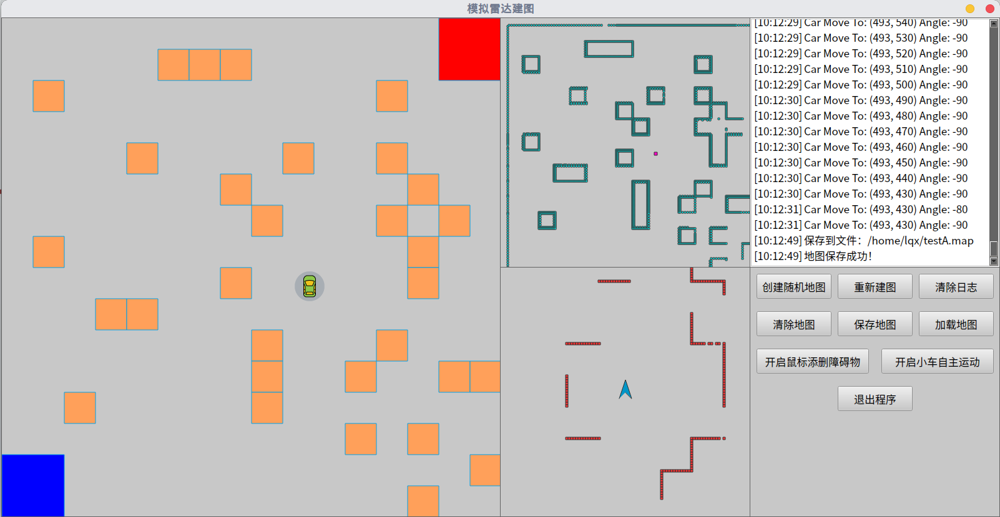
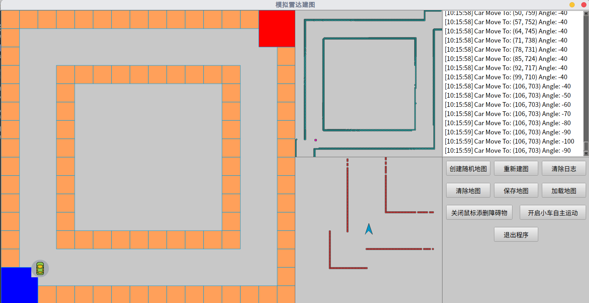
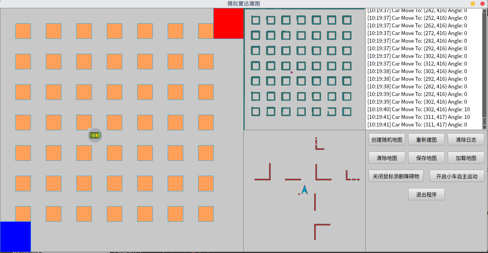

# Qt-based LIDAR Mapping Simulator

This program demonstrates the whole process of using lidar to construct a map.

## Prerequisites

We have tested in Ubuntu 18.04, but it should be easy to compile in other platforms.

#### QT5

You can install qt4 in Ubuntu by:

```bash
sudo apt-get install qt5-default qtcreator
```

## Compile:

```bash
qmake Simulation.pro
make
```

## Usage:

you can run this program by:

```bash
./Simulation
```

**Keyboard:**

- `up_arrow` - move forward
- `down_arrow` - move backward
- `left_arrow` - turn left
- `right_arrow` - turn right

**Mouse:**

- `Right click` - remove obstacles
- `Left click` - add obstacles

##  Screenshot






